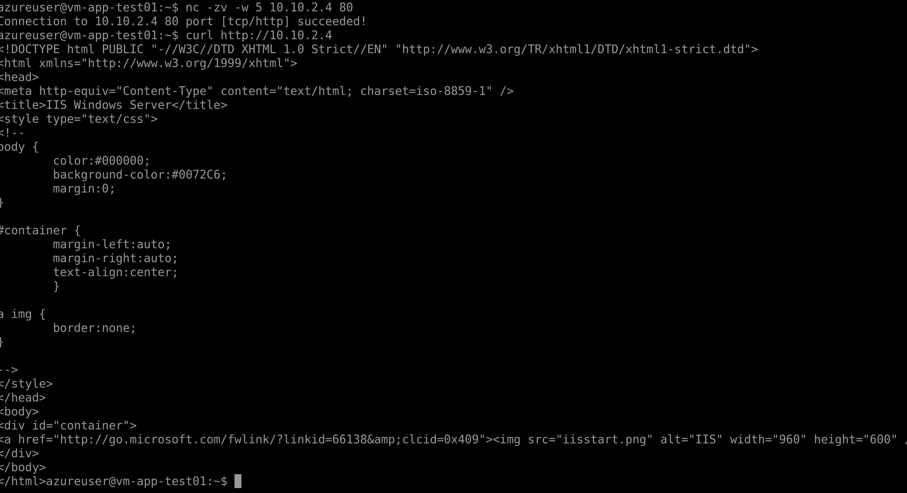
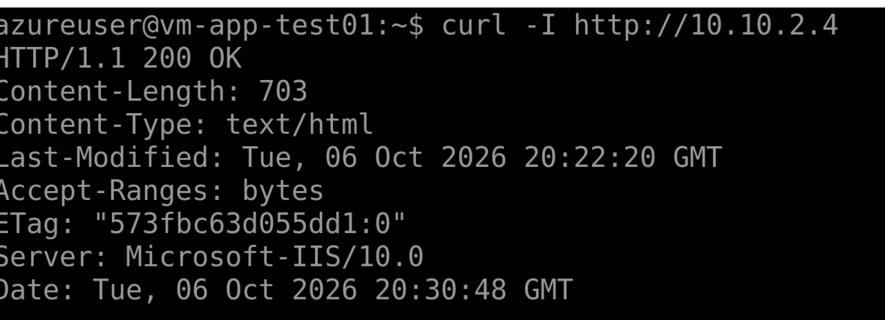
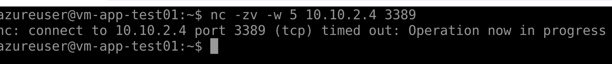

# Azure-Enterprise-Network
Azure administration project demonstrating virtual networking, segmentation, secure VM administration, and monitoring.
## Project Overview
This project simulates an Azure enterprise environment designed to provide secure network segmentation, controlled administrative access, and centralized monitoring for cloud hosted resources. 

The environment uses a segmented Azure Virtual Network with dedicated subnets for management, application, and server workloads. Network Security Groups (NSGs) enforce least-privilege communication between subnets, while production servers remain private without directly assigned public IP addresses.

Azure Monitor Agent and Log Analytics provide centralized monitoring for the Windows Server environment. During implementation, a connectivity issue prevented the monitoring agent from retrieving its Data Collection Rule configuration. Troubleshooting identified that the server subnet was configured as a private subnet with no default outbound access. An Azure NAT Gateway was implemented to provide explicit outbound connectivity, allowing the agent to communicate with Azure Monitor while keeping the server private.

## Technologies Used

- Microsoft Azure
- Azure Virtual Network
- Network Security Groups (NSGs)
- Azure Virtual Machines
- Azure NAT Gateway
- Azure Monitor Agent
- Data Collection Rules
- Log Analytics Workspace
- Windows Server 2022
- IIS
- Ubuntu Linux
- PowerShell

## Network Architecture

The Azure environment uses the `10.10.0.0/16` address space with separate subnets for management, server, application, and secure administrative access.

| Resource | Address Space | Purpose |
|---|---|---|
| vnet-enterprise-prod | 10.10.0.0/16 | Production virtual network |
| snet-management | 10.10.1.0/24 | Administrative and management resources |
| snet-servers | 10.10.2.0/24 | Windows Server workloads |
| snet-apps | 10.10.3.0/24 | Application and testing workloads |
| AzureBastionSubnet | 10.10.4.0/26 | Secure Azure Bastion connectivity |

### Virtual Machines

| Virtual Machine | Subnet | Private IP | Role |
|---|---|---|---|
| vm-prod-server01 | snet-servers | 10.10.2.4 | Windows Server 2022 / IIS |
| vm-app-test01 | snet-apps | 10.10.3.4 | Ubuntu test client |

Both virtual machines were deployed without directly assigned public IP addresses to reduce exposure to the public internet.

## Network Security

The server subnet is protected by `nsg-servers`. Custom NSG rules enforce least-privilege communication between workloads.

| Priority | Rule | Source | Destination | Port | Action |
|---|---|---|---|---|---|
| 100 | Allow-RDP-From-Management | 10.10.1.0/24 | 10.10.2.0/24 | TCP 3389 | Allow |
| 110 | Allow-RDP-From-Bastion | 10.10.4.0/26 | 10.10.2.0/24 | TCP 3389 | Allow |
| 120 | Allow-HTTP-From-Apps | 10.10.3.0/24 | 10.10.2.0/24 | TCP 80 | Allow |
| 200 | Deny-VNet-Inbound | VirtualNetwork | 10.10.2.0/24 | Any | Deny |

This configuration allows the application subnet to reach the IIS server over HTTP while preventing it from using RDP to access the server.
### Network Segmentation Validation

The NSG configuration was validated from the application VM to confirm that only required traffic could reach the server subnet.

#### HTTP Allowed

The application VM successfully established a connection to the IIS server over TCP port 80.



IIS connectivity was also validated using `curl`, confirming a successful HTTP response from the Windows Server.



#### RDP Blocked

An RDP connectivity test from the application VM to the Windows Server timed out, confirming that TCP port 3389 was blocked between the application and server subnets.




## Troubleshooting and Resolution

### Azure Monitor Agent Unable to Retrieve Configuration

After deploying the Azure Monitor Agent (AMA) and associating the Windows Server with a Data Collection Rule (DCR), no heartbeat or Windows event data appeared in the Log Analytics workspace.

Initial validation confirmed that:

- The Azure Monitor Agent extension was successfully provisioned.
- AMA processes were running on the Windows Server.
- The VM was associated with the correct Data Collection Rule.
- A system-assigned managed identity was enabled.
- The AMA configuration directory did not contain downloaded DCR configuration files.

Connectivity testing was performed from the Windows Server:

```powershell
Test-NetConnection global.handler.control.monitor.azure.com -Port 443
```
TcpTestSucceeded : False
Further investigation revealed that `snet-servers` was configured as a private subnet with no default outbound access. The server therefore had no path to the Azure Monitor service.

## Resolution
An Azure NAT Gateway was deployed and associated with `snet-servers` to provide outbound connectivity while allowing `vm-prod-server01` to remain without a public IP address. After configuring the NAT Gateway the connectivity test returned TcpTestSucceeded : True. The Azure Monitor agent was able to download its DCR configuration and Heartbeat began appearing in the Log Analytics Workspace. 

## Validation

Network segmentation was validated from `vm-app-test01` in the application subnet against `vm-prod-server01` in the server subnet.

### HTTP Connectivity

The application VM was able to reach the IIS server over TCP port 80:

```bash
nc -zv -w 5 10.10.2.4 80
```
Connection succeeded

## RDP Segmentation
The application VM was then tested against TCP port 3389.
```bash
nc -zv -w 5 10.10.2.4 3389
```
Connection timed out as expected. These tests confirmed that the NSG allowed required application traffic while blocking unauthorized administrative access between the application and server subnets. 
